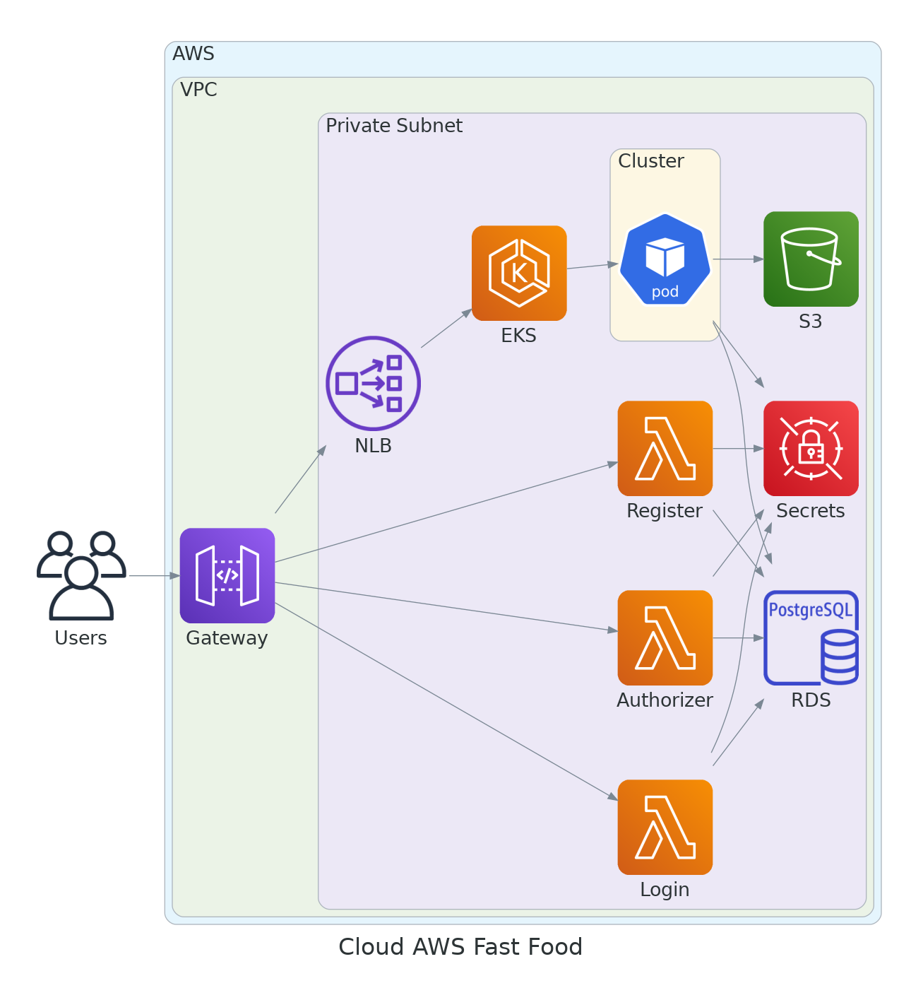

# Fast-Food k8s Cluster

This project is responsible for provisioning a k8s cluster on AWS using EKS. The cluster is provisioned with a VPC, subnets, and security groups. The cluster is also provisioned with a storage class and a few addons.

# Diagram of the complete infrastructure

# Provisioning
<!-- BEGIN_TF_DOCS -->

## Requirements

| Name | Version |
|------|---------|
|  [terraform](#requirement\_terraform) | 1.7.4 |
|  [aws](#requirement\_aws) | 5.38.0 |
## Providers

| Name | Version |
|------|---------|
|  [helm](#provider\_helm) | 2.12.1 |
## Inputs

| Name | Description | Type | Default | Required |
|------|-------------|------|---------|:--------:|
|  [azs](#input\_azs) | The availability zones to use for the VPC | `list(string)` | <pre>[   "us-east-1a",   "us-east-1b",   "us-east-1c" ]</pre> | no |
|  [bucket\_name](#input\_bucket\_name) | The name of the S3 bucket to store the tfstate file | `any` | n/a | yes |
|  [cluster\_name](#input\_cluster\_name) | The name of the EKS cluster | `string` | `"fastfood"` | no |
|  [cluster\_version](#input\_cluster\_version) | The version of Kubernetes to use | `string` | `"1.29"` | no |
|  [region](#input\_region) | The default region to use for AWS | `string` | `"us-east-1"` | no |
|  [tags](#input\_tags) | The default tags to use for AWS resources | `map(string)` | <pre>{   "App": "cluster" }</pre> | no |
|  [vpc\_cidr](#input\_vpc\_cidr) | The CIDR block for the VPC | `string` | `"10.0.0.0/16"` | no |
## Modules

| Name | Source | Version |
|------|--------|---------|
|  [addon](#module\_addon) | ./modules/addon | n/a |
|  [cluster](#module\_cluster) | ./modules/cluster | n/a |
|  [network](#module\_network) | ./modules/network | n/a |
|  [storage](#module\_storage) | ./modules/storage | n/a |
## Resources

| Name | Type |
|------|------|
| [helm_release.csi-secrets-store](https://registry.terraform.io/providers/hashicorp/helm/latest/docs/resources/release) | resource |
| [helm_release.secrets-provider-aws](https://registry.terraform.io/providers/hashicorp/helm/latest/docs/resources/release) | resource |
## Outputs

No outputs.
<!-- END_TF_DOCS -->

## Modules

- [addon](./docs/addon.md)
- [cluster](./docs/cluster.md)
- [network](./docs/network.md)